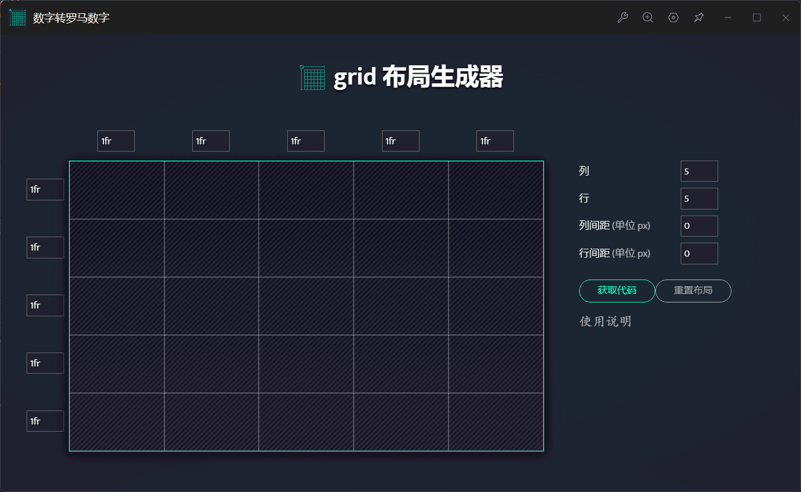
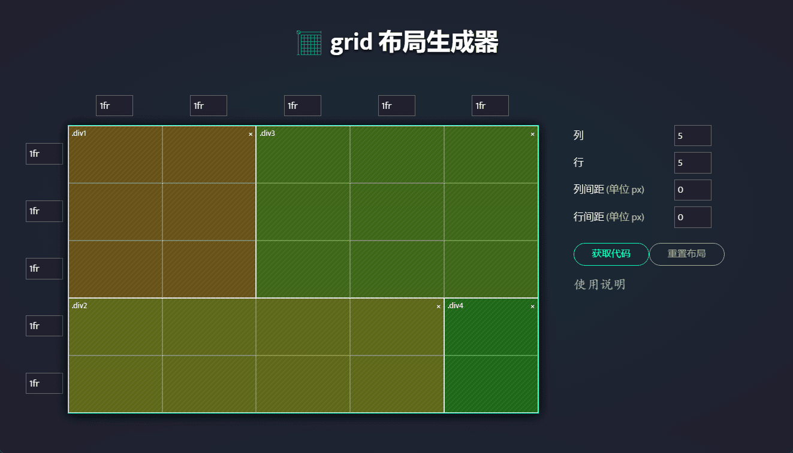
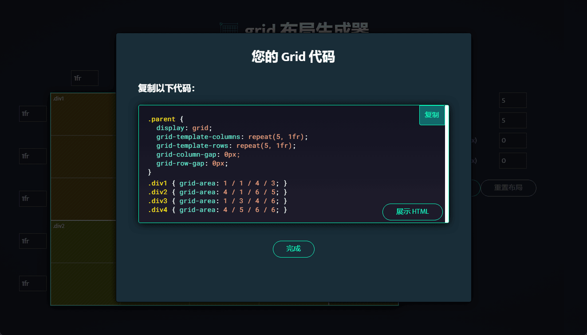

# utools-cssGridGenerator

utools插件版cssgridgenerator🐶

> 因[https://cssgrid-generator.netlify.com/](https://cssgrid-generator.netlify.com/)域名过期，所以迁移至utools插件中使用；

源项目地址：[cssgridgenerator](https://github.com/sdras/cssgridgenerator)

